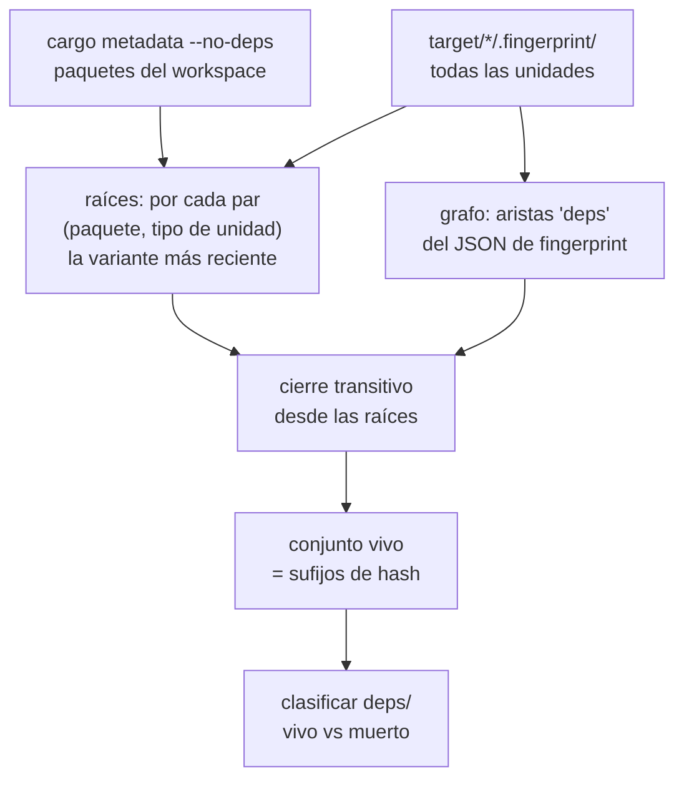

# cargo-reap

Recolector de basura para directorios `target/` de Cargo.

**Estado: funcional.** Identifica lo muerto (_mark_) y lo saca (_sweep_). Por
defecto sólo simula: hay que pasar `--apply` para que toque algo.

## El problema

Cargo nunca recolecta basura. Cada vez que cambia una versión, un feature, un
rustflag o la versión de rustc, escribe un artefacto nuevo con otro sufijo de
hash y deja el anterior ahí para siempre. En un proyecto de vida larga la mayor
parte de `target/` son cadáveres.

Medido sobre proyectos reales (septiembre 2026):

| proyecto | por defecto | `--incremental --codegen` |
|----------|------------:|--------------------------:|
| A        |   24.76 GB |  28.84 GB |
| B        |    7.62 GB |  20.33 GB |
| C        |    2.01 GB |   6.70 GB |
| D        |    1.80 GB |   4.61 GB |
| E        |    1.45 GB |   2.79 GB |
| F        |    1.05 GB |   1.51 GB |
| G        |  773.65 MB | 773.65 MB |

Sobre 20 proyectos que ocupan 89.5 GB en total: **39.86 GB recuperables** con la
configuración por defecto, **66.81 GB** con todo activado. El proyecto A solo
aporta 24.76 GB porque acumuló 68 variantes de fingerprint de un mismo crate del
workspace.

## Por qué no sirve deduplicar

La primera hipótesis fue un almacén content-addressed con reflinks, al estilo de
[kache](https://github.com/kunobi-ninja/kache). Se midió antes de construirlo:
de los 504 artefactos de más de 20 MB repartidos en todos los `target/`, solo el
**5% de los bytes está duplicado**.

La razón es que Cargo mete el grafo completo de dependencias y features en el
hash `-C metadata`, así que dos proyectos que usan la misma versión de un crate
igual lo compilan a bytes distintos. De 3.977 rlibs, solo 134 se repiten entre
proyectos.

Deduplicar recupera ~1.2 GB. Recolectar basura recupera ~39 GB.

## Por qué no sirve podar por antigüedad

Es lo que hace `cargo-sweep`, y **borra artefactos vivos**.

Experimento: proyecto con 28 unidades, todas frescas. Se toca un solo archivo
fuente y se recompila. Resultado: **solo 1 de las 28** actualizó su
`invoked.timestamp`. Las otras 27, vivas y en uso, conservaron la fecha vieja.

Cargo solo toca `invoked.timestamp` de las unidades que **recompila**. Una
dependencia estable mantiene su fecha original indefinidamente, así que su edad
no dice nada sobre si sigue viva.

## El algoritmo



Las dos mitades son necesarias y ninguna basta sola:

- **El tiempo solo** no sirve, por lo del `invoked.timestamp` de arriba.
- **El grafo solo** tampoco: una variante obsoleta sigue siendo alcanzable desde
  el padre obsoleto que la referenciaba, porque ese padre también sigue ahí.

La combinación sí funciona. Las raíces recientes del workspace fijan la
configuración vigente, y el cierre transitivo rescata sus dependencias por viejas
que sean sus fechas.

## Tres detalles de Cargo que costó descubrir

1. **El hash del directorio de fingerprint es el mismo que el del artefacto.**
   `.fingerprint/sqlparser-3aed8a7b2a1da43b/` ↔ `deps/libsqlparser-3aed8a7b2a1da43b.rlib`.
   Es el valor que Cargo pasa a rustc vía `-C extra-filename`.

2. **Los hashes de fingerprint se serializan en little-endian.** Cargo escribe
   `hex::encode(num.to_le_bytes())`. Leerlos como un entero hexadecimal normal da
   un número distinto y **ninguna** arista del grafo resuelve. Con el orden
   correcto resuelven 8.917 de 8.918.

3. **El hash de un artefacto está antes del primer punto del nombre**, no antes
   de la última extensión. Los objetos de codegen se llaman
   `adler2-33c837f7cd28a9af.adler2.33fb6cf-cgu.0.rcgu.o`. En el `target/debug/deps`
   del proyecto B hay 41.186 de esos archivos, 11.49 GB — la mitad del directorio.

## Uso

```bash
cargo reap <ruta-a-target>                     # simula: informa y no toca nada
cargo reap <ruta-a-target> --apply             # mueve lo muerto a la papelera
cargo reap <ruta-a-target> --apply --no-trash  # borra directo
cargo reap <ruta-a-target> --keep-configs 3    # conserva 3 configuraciones
cargo reap <ruta-a-target> --list-dead         # rutas, una por línea

cargo reap ~/Proyectos --apply --incremental --codegen   # todos de una pasada
```

Sin `--apply` no se modifica nada: el modo por defecto es simulación.

Si la ruta **no** es un `target/`, se buscan todos los que cuelguen de ella (los
reconoce por el `CACHEDIR.TAG` que Cargo deja en la raíz de cada uno) y se
procesan uno a uno, con una línea de resumen por proyecto. Un proyecto que falle
no interrumpe el recorrido. Es la forma pensada para un cron semanal.

### Qué recolecta

- `deps/`, archivo por archivo.
- `.fingerprint/` y `build/`, por directorio de unidad.
- `incremental/` sólo con `--incremental`: es desechable por definición, pero el
  costo de borrarlo es un build lento, así que va aparte.
- Los `.rcgu.o` de unidades **vivas**, sólo con `--codegen`. Son objetos de
  codegen intermedios que rustc reemite al recompilar la unidad, y Cargo no los
  cuenta entre los outputs que verifica: borrarlos no ensucia el fingerprint ni
  fuerza un rebuild. Es la bolsa más grande que queda — 11.49 GB sólo en el
  proyecto B, la mitad de su `debug/deps`. Los de unidades muertas ya salen por
  defecto.

Los archivos sueltos de `target/<profile>/` (`libapp_core.rlib` y compañía)
no se tocan: no llevan sufijo de hash y son las salidas vigentes.

### Las tres salvaguardas

1. **Simulación por defecto.** `--apply` es explícito.
2. **Papelera con retención.** Lo barrido va a `<target>/.reap-trash/<timestamp>/`
   conservando la ruta relativa, así que rescatar algo es copiar el árbol de
   vuelta. Se purga solo a los `--retain-days` días (7 por defecto). Como es un
   rename dentro del mismo sistema de archivos, no copia bytes.
3. **Respeta el lock de Cargo.** Antes de tocar un perfil se intenta un `flock`
   no bloqueante sobre `<profile>/.cargo-lock`, el mismo que usa Cargo. Si está
   tomado hay un build corriendo y ese perfil se omite entero, porque si no
   estaríamos borrando artefactos que rustc está escribiendo en ese instante.

Y una cuarta implícita: **el peor caso de un error es una recompilación**, nunca
un binario incorrecto. Es la diferencia de fondo con una caché de compilador,
donde una clave mal calculada te hace desplegar algo viejo sin que te enteres.

`--keep-configs` es el único knob real y conviene entenderlo: conserva las N
configuraciones más recientes de cada unidad. Con 1 se recupera el máximo, pero
alternar juegos de features obliga a recompilar. La curva no es lineal ni igual
en todos los proyectos:

| proyecto | keep=1 | keep=2 | keep=3 | keep=5 |
|----------|-------:|-------:|-------:|-------:|
| A        | 24.56 GB | 22.49 GB | 21.62 GB | 18.66 GB |
| B        |  7.53 GB |  1.16 GB |   670 MB |   610 MB |
| D        |  1.80 GB |  1.34 GB |   992 MB |   232 MB |

El proyecto B cae en picada de keep=1 a keep=2: su segunda configuración más
reciente pesa 6.4 GB sola. El A casi no baja, porque con 68 variantes conservar 5
sigue descartando 63.

## El fallo que encontró la validación

La primera versión definía las raíces como «por cada par (paquete del workspace,
tipo de unidad), la variante más reciente». Un test con basura sintética mostró
el agujero: una unidad cuyo tipo **ya no existe** en el build actual —un binario
renombrado, un test de integración borrado, un miembro del workspace eliminado—
forma un grupo de un solo miembro, se auto-declara raíz y no se recolecta nunca.
Con ella sobrevive todo su subárbol de dependencias.

El arreglo es pedirle a `cargo metadata` los targets que cada paquete declara
hoy y exigir que el nombre de la unidad corresponda a uno de ellos. Sin eso, la
herramienta filtra espacio justo en los proyectos que más han cambiado de forma.

## Qué está validado y qué no

**Validado end-to-end, fase mark.** Proyecto con dependencias reales y build
scripts, compilado en dos configuraciones. Se marcó, se barrieron los 53
archivos muertos (`deps/` de 45 MB a 23 MB) y el `cargo build` siguiente quedó
en no-op de 0.01s sin recompilar nada.

**Validado end-to-end, `--codegen`.** Sobre una copia de un proyecto real ya
compilado: `deps/` pasó de 87 MB a 4.0 MB (2.441 objetos), `cargo build` siguió
en no-op, y una recompilación de verdad —tocando un fuente— funcionó normal en
0.30s. Se probó primero a mano y después a través de la herramienta.

**Validado end-to-end, fase sweep.** Sobre un target ya compilado con basura
sintética inyectada (variantes con hash inventado en `deps/`, `.fingerprint/` y
`build/`, incluida una del propio crate del workspace simulando un binario
renombrado): se barrieron las tres zonas, sobrevivieron **cero** entradas
falsas, y `cargo build` siguió siendo no-op. También se verificó, cada una por
separado: la papelera preserva la ruta relativa, la purga respeta la retención,
`--no-trash` borra sin papelera, y con el `.cargo-lock` tomado por otro proceso
el perfil se omite y no se toca nada suyo.

**Sin validar.** Un workspace multi-crate con build script propio y tests de
integración, compilado desde cero. El fixture no llegó a compilar en esta
máquina: los build scripts mueren con SIGKILL, un problema del entorno macOS
ajeno a la herramienta. Falta reproducirlo en Linux.

**Salvaguarda extra.** Un perfil sin ninguna unidad del workspace no se toca: es
más probable que sea un perfil ajeno (sólo build scripts de dependencias) que
basura legítima. Se ve en el `x86_64-unknown-linux-musl/debug` del proyecto B.

## Lo que falta

- [ ] **Validar en Linux**, donde los build scripts sí corren, con un workspace
      multi-crate compilado desde cero.
- [ ] **No compila en Windows**: `build_en_curso()` usa `libc::flock` y
      `std::os::unix`. Bloqueante sólo para publicar en crates.io.
- [ ] Modo "proyecto entero": evictar el `target/` completo de proyectos sin
      tocar en N meses.
- [ ] Un `launchd`/`systemd` timer de ejemplo en el repo.
- [ ] Publicar en crates.io como subcomando `cargo reap`.

Fuera de alcance, mismo problema: `~/.rustup` (10.15 GB de toolchains) y
`~/.cargo` (2.78 GB de registro) los resuelven `rustup toolchain remove` y
`cargo-cache`.

## Licencia

Apache-2.0
