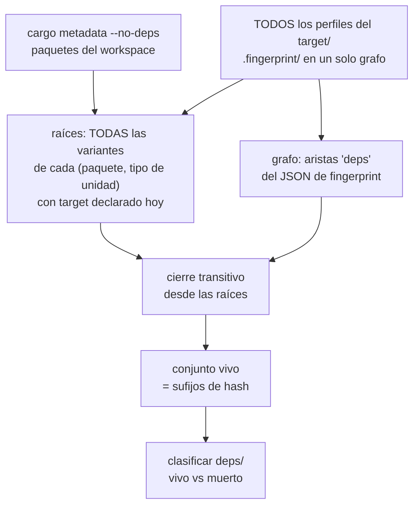

# cargo-reap

Recolector de basura para directorios `target/` de Cargo.

**Estado: funcional en macOS**, validado end-to-end sobre workspaces reales,
incluido uno cruzado a `x86_64-unknown-linux-musl`. Identifica lo muerto (_mark_)
y lo saca (_sweep_). Por defecto sólo simula: hay que pasar `--apply` para que
toque algo. Falta ejecutarlo *en* Linux.

## El problema

Cargo nunca recolecta basura. Cada vez que cambia una versión, un feature, un
rustflag o la versión de rustc, escribe un artefacto nuevo con otro sufijo de
hash y deja el anterior ahí para siempre. En un proyecto de vida larga la mayor
parte de `target/` son cadáveres.

Medido sobre 20 proyectos reales con 91.2 GB de `target/` (septiembre 2026):

| proyecto | por defecto | `--incremental` |
|----------|------------:|----------------:|
| B        |   11.56 GB |  15.85 GB |
| A        |    8.65 GB |  12.94 GB |
| C        |    3.01 GB |   6.09 GB |
| D        |    2.22 GB |   4.32 GB |
| E        |    1.69 GB |   2.75 GB |
| H        |  355.20 MB | 539.22 MB |
| K        |   72.21 MB | 157.73 MB |
| I        |   16.66 MB |  16.66 MB |

**27.57 GB recuperables** por defecto — un 30% de todo lo que ocupan esos
`target/` — y **42.76 GB**, casi la mitad, añadiendo `--incremental`.

De dónde sale ese espacio, que no es donde uno esperaría:

| origen | recupera | cuesta |
|--------|---------:|--------|
| artefactos muertos (mark por grafo) | 1.64 GB | nada |
| `.rcgu.o` de unidades vivas | 25.93 GB | nada |
| `incremental/` | 15.19 GB | el próximo build es lento |

La recolección por grafo —la parte difícil, la que da nombre a esta
herramienta— es la porción pequeña. El grueso son los objetos de codegen
intermedios que rustc deja tirados en `deps/`: Cargo no los cuenta entre los
outputs que verifica y los reemite si alguna vez recompila esa unidad, así que
borrarlos no provoca ni una recompilación extra. Por eso van en el
comportamiento por defecto.

`incremental/` es igual de desechable pero sí tiene precio, así que queda detrás
de un flag. Y el mark por grafo, aunque rinda poco en GB, es lo que permite
borrar artefactos muertos sin adivinar, que es un problema distinto: es la
diferencia entre recolectar y podar a ciegas.

## Por qué no sirve deduplicar

La primera hipótesis fue un almacén content-addressed con reflinks, al estilo de
[kache](https://github.com/kunobi-ninja/kache). Se midió antes de construirlo:
de los 504 artefactos de más de 20 MB repartidos en todos los `target/`, solo el
**5% de los bytes está duplicado**.

La razón es que Cargo mete el grafo completo de dependencias y features en el
hash `-C metadata`, así que dos proyectos que usan la misma versión de un crate
igual lo compilan a bytes distintos. De 3.977 rlibs, solo 134 se repiten entre
proyectos.

Deduplicar recupera ~1.2 GB. Recolectar basura recupera ~39 GB.

## Por qué no sirve podar por antigüedad

Es lo que hace `cargo-sweep`, y **borra artefactos vivos**.

Experimento: proyecto con 28 unidades, todas frescas. Se toca un solo archivo
fuente y se recompila. Resultado: **solo 1 de las 28** actualizó su
`invoked.timestamp`. Las otras 27, vivas y en uso, conservaron la fecha vieja.

Cargo solo toca `invoked.timestamp` de las unidades que **recompila**. Una
dependencia estable mantiene su fecha original indefinidamente, así que su edad
no dice nada sobre si sigue viva.

Esta herramienta cayó en su propia trampa y tardó en verlo, así que conviene
dejarlo escrito: el conocimiento de arriba se aplicó al _mark_, pero las raíces
se elegían por fecha, quedándose con la variante más reciente de cada unidad del
workspace. Es el mismo error un paso antes. Si tu último build fue
`cargo build --features x`, la configuración del `cargo build` pelado queda
obsoleta **por fecha** aunque sea la que vas a usar mañana; al no ser raíz, se
barre ella y con ella todo su árbol de dependencias.

En un workspace real de 10 paquetes eso barrió 240 de las 306 unidades que el
build necesitaba: el 78% del conjunto vivo. Por eso hoy el criterio no tiene
componente temporal.

## El algoritmo



Lo que hace vivo a un artefacto es ser alcanzable desde una unidad del
workspace que todavía corresponda a un target declarado hoy. Nada más. En
particular **no** se mira la fecha: ver más abajo por qué eso es una trampa.

Lo que muere, entonces, es lo que ya no alcanza nadie: variantes de una
dependencia que ningún miembro vivo del workspace referencia, y unidades de
paquetes o targets que dejaron de existir.

## Tres detalles de Cargo que costó descubrir

1. **El hash del directorio de fingerprint es el mismo que el del artefacto.**
   `.fingerprint/sqlparser-3aed8a7b2a1da43b/` ↔ `deps/libsqlparser-3aed8a7b2a1da43b.rlib`.
   Es el valor que Cargo pasa a rustc vía `-C extra-filename`.

2. **Los hashes de fingerprint se serializan en little-endian.** Cargo escribe
   `hex::encode(num.to_le_bytes())`. Leerlos como un entero hexadecimal normal da
   un número distinto y **ninguna** arista del grafo resuelve. Con el orden
   correcto resuelven 8.917 de 8.918.

3. **El hash de un artefacto está antes del primer punto del nombre**, no antes
   de la última extensión. Los objetos de codegen se llaman
   `adler2-33c837f7cd28a9af.adler2.33fb6cf-cgu.0.rcgu.o`. En el `target/debug/deps`
   del proyecto B hay 41.186 de esos archivos, 11.49 GB — la mitad del directorio.

## Uso

```bash
cargo reap <ruta-a-target>                     # simula: informa y no toca nada
cargo reap <ruta-a-target> --apply             # mueve lo muerto a la papelera
cargo reap <ruta-a-target> --apply --no-trash  # borra directo
cargo reap <ruta-a-target> --keep-configs 3    # poda agresiva: puede forzar rebuild
cargo reap <ruta-a-target> --keep-codegen     # no tocar los .rcgu.o vivos
cargo reap <ruta-a-target> --list-dead         # rutas, una por línea

cargo reap ~/Proyectos --apply --incremental            # todos de una pasada
```

Sin `--apply` no se modifica nada: el modo por defecto es simulación.

Si la ruta **no** es un `target/`, se buscan todos los que cuelguen de ella (los
reconoce por el `CACHEDIR.TAG` que Cargo deja en la raíz de cada uno) y se
procesan uno a uno, con una línea de resumen por proyecto. Un proyecto que falle
no interrumpe el recorrido. Es la forma pensada para un cron semanal.

### Qué recolecta

- `deps/`, archivo por archivo.
- `.fingerprint/` y `build/`, por directorio de unidad.
- `incremental/` sólo con `--incremental`: es desechable por definición, pero el
  costo de borrarlo es un build lento, así que va aparte.
- Los `.rcgu.o` de unidades **vivas**, salvo que pases `--keep-codegen`. Son objetos de
  codegen intermedios que rustc reemite al recompilar la unidad, y Cargo no los
  cuenta entre los outputs que verifica: borrarlos no ensucia el fingerprint ni
  fuerza un rebuild. Es la bolsa más grande que queda — 11.49 GB sólo en el
  proyecto B, la mitad de su `debug/deps`. Los de unidades muertas ya salen por
  defecto.

Los archivos sueltos de `target/<profile>/` (`libapp_core.rlib` y compañía)
no se tocan: no llevan sufijo de hash y son las salidas vigentes.

### Las tres salvaguardas

1. **Simulación por defecto.** `--apply` es explícito.
2. **Papelera con retención.** Lo barrido va a `<target>/.reap-trash/<timestamp>/`
   conservando la ruta relativa, así que rescatar algo es copiar el árbol de
   vuelta. Se purga solo a los `--retain-days` días (7 por defecto). Como es un
   rename dentro del mismo sistema de archivos, no copia bytes.
3. **Respeta el lock de Cargo.** Antes de tocar un perfil se intenta un `flock`
   no bloqueante sobre `<profile>/.cargo-lock`, el mismo que usa Cargo. Si está
   tomado hay un build corriendo y ese perfil se omite entero, porque si no
   estaríamos borrando artefactos que rustc está escribiendo en ese instante.

Y una cuarta implícita: **el peor caso de un error es una recompilación**, nunca
un binario incorrecto. Es la diferencia de fondo con una caché de compilador,
donde una clave mal calculada te hace desplegar algo viejo sin que te enteres.

`--keep-configs N` es el único knob real, y por defecto **no está activo**:
se conservan todas las configuraciones. Pasarlo descarta por antigüedad todas
menos las N más recientes de cada unidad. Recupera bastante más espacio y puede
costarte un rebuild completo; la herramienta avisa por stderr cuando lo usas.

No lo uses en un proyecto en el que alternes juegos de features, perfiles o
toolchains. Lee la sección siguiente antes de decidir.

## Los tres fallos que encontró la validación

### El que encontró un fixture sintético

La primera versión definía las raíces como «por cada par (paquete del workspace,
tipo de unidad), la variante más reciente». Un test con basura sintética mostró
el agujero: una unidad cuyo tipo **ya no existe** en el build actual —un binario
renombrado, un test de integración borrado, un miembro del workspace eliminado—
forma un grupo de un solo miembro, se auto-declara raíz y no se recolecta nunca.
Con ella sobrevive todo su subárbol de dependencias.

El arreglo es pedirle a `cargo metadata` los targets que cada paquete declara
hoy y exigir que el nombre de la unidad corresponda a uno de ellos. Sin eso, la
herramienta filtra espacio justo en los proyectos que más han cambiado de forma.

### El que sólo apareció en un proyecto de verdad

El segundo es el de la poda por antigüedad en las raíces, contado más arriba, y
merece una nota aparte por cómo se encontró: **ningún test ni fixture lo
detectó**. Los fixtures se construyen compilando una configuración y ensuciando
el `target/`, así que nunca tienen dos configuraciones del workspace compitiendo
por ser la más reciente. Hizo falta un workspace de verdad, con meses de builds
alternando features encima.

La lección práctica: para una herramienta que borra, un fixture sintético valida
el mecanismo pero no el criterio. El criterio sólo se valida contra un `target/`
con historia.

Y el método que lo demostró vale para cualquiera que toque esto:
`cargo build --message-format=json` emite los artefactos **fresh** con su ruta
real, así que da la lista exacta de lo que el build necesita, sin compilar nada.
Cruzarla contra `--list-dead` es la prueba objetiva de si el mark es correcto.

### El que sólo aparece al cruzar-compilar

Al compilar para otro target, el grafo abarca **dos** directorios de perfil.
Las unidades de `x86_64-unknown-linux-musl/release/` dependen de proc-macros y
build scripts que viven en el `release/` del host, porque esos se compilan para
la máquina que compila, no para el target.

La herramienta analizaba cada perfil por separado. Esas aristas no resolvían —el
síntoma visible era un 95.2% de aristas resueltas en el perfil del target, contra
~100% en los demás—, el lado host parecía inalcanzable y se marcaba entero como
muerto: en un workspace real, **150 de las 581 unidades que el build necesitaba**,
434 MB de proc-macros y `.rmeta`. Barrerlos obliga a recompilar el workspace
completo, que con LTO son minutos.

El arreglo es calcular el conjunto vivo una sola vez sobre todos los perfiles del
`target/`, en un solo grafo. Después de eso las aristas resuelven al 100% y el
perfil del host se queda entero.

Un porcentaje de aristas resueltas por debajo de 100 no es una curiosidad
estadística: es la señal de que al grafo le faltan nodos, y todo lo que colgaba
de ellos está a punto de considerarse basura.

## Qué está validado y qué no

**Validado end-to-end, fase mark.** Proyecto con dependencias reales y build
scripts, compilado en dos configuraciones. Se marcó, se barrieron los 53
archivos muertos (`deps/` de 45 MB a 23 MB) y el `cargo build` siguiente quedó
en no-op de 0.01s sin recompilar nada.

**Validado end-to-end, los `.rcgu.o` de unidades vivas.** Sobre una copia de un
proyecto real ya compilado: `deps/` pasó de 87 MB a 4.0 MB (2.441 objetos),
`cargo build` siguió en no-op, y una recompilación de verdad —tocando un
fuente— funcionó normal en 0.30s. Repetido después sobre el workspace cruzado a
musl: 67 objetos barridos, `cargo build` y `cargo build --tests` en no-op, y el
`--release` posterior compiló sin novedad. Con LTO fat no hay nada que barrer:
rustc emite bitcode y no deja objetos por unidad de codegen.

**Validado end-to-end, fase sweep.** Sobre un target ya compilado con basura
sintética inyectada (variantes con hash inventado en `deps/`, `.fingerprint/` y
`build/`, incluida una del propio crate del workspace simulando un binario
renombrado): se barrieron las tres zonas, sobrevivieron **cero** entradas
falsas, y `cargo build` siguió siendo no-op. También se verificó, cada una por
separado: la papelera preserva la ruta relativa, la purga respeta la retención,
`--no-trash` borra sin papelera, y con el `.cargo-lock` tomado por otro proceso
el perfil se omite y no se toca nada suyo.

**Validado end-to-end cruzando a Linux.** Workspace multi-crate con build script
propio en cada miembro y tests de integración, compilado desde cero contra
`x86_64-unknown-linux-musl` con `cargo-zigbuild`, que reparte las unidades entre
el perfil del host y el del target. Se inyectó basura real —un binario borrado y
un test de integración renombrado—, se barrieron 27.46 MB y tanto `cargo build`
como `cargo build --tests` siguieron en no-op; tocar un fuente recompiló sólo esa
unidad.

**Validado sobre un workspace real cruzado a musl.** 3.4 GB de artefactos Linux,
47 build scripts. Cruzado contra la lista de artefactos *fresh* de Cargo: 0 de
581 unidades vivas marcadas como muertas. Con la versión anterior eran 150.

**Validado end-to-end sobre un workspace real.** 10 paquetes, 3.246 unidades,
31 GB de `target/` y meses de builds con distintos juegos de features. Cruzado
contra la lista de artefactos *fresh* de Cargo: **0 de 306** unidades vivas
marcadas como muertas. Se barrieron 3.95 GB, el `cargo build` siguiente quedó en
no-op de 0.33s, y tocar un fuente recompiló **sólo** esa unidad, en 5.37s, sin
cascada.

Ese mismo proyecto, con la versión anterior, perdía 240 de esas 306 unidades.

**Sin validar.** Ejecutar la herramienta *en* Linux. Todo lo anterior corre en
macOS, aunque los artefactos analizados sean de Linux. Queda por comprobar ahí el
`flock` sobre `.cargo-lock` y el rename de la papelera entre sistemas de archivos.

**Nota para compilar en macOS arm64.** Los build scripts salen con una firma
adhoc inválida y AMFI los mata con SIGKILL en cuanto Cargo los ejecuta. Se
esquiva con un linker que re-firme lo que enlaza:

```sh
cat > /tmp/signcc <<'EOF'
#!/bin/sh
cc "$@"; st=$?
out=""; prev=""
for a in "$@"; do [ "$prev" = "-o" ] && out="$a"; prev="$a"; done
[ $st -eq 0 ] && [ -n "$out" ] && [ -f "$out" ] && codesign -f -s - "$out" 2>/dev/null
exit $st
EOF
chmod +x /tmp/signcc
CARGO_TARGET_AARCH64_APPLE_DARWIN_LINKER=/tmp/signcc cargo build
```

**Salvaguarda extra.** Un perfil sin ninguna unidad del workspace no se toca: es
más probable que sea un perfil ajeno (sólo build scripts de dependencias) que
basura legítima. Se ve en el `x86_64-unknown-linux-musl/debug` del proyecto B.

## Lo que falta

- [ ] **Ejecutar la herramienta en Linux** y validar ahí el `flock` y la papelera.
- [ ] **Recuperar más sin volver a adivinar.** Hoy se conservan todas las
      configuraciones del workspace, y eso deja espacio sobre la mesa: en el
      proyecto A conviven 68 variantes de un mismo crate y casi todas están
      muertas de verdad. El hash `config` del JSON de fingerprint es global por
      invocación y sólo uno puede ser el vigente, así que las unidades con otro
      son irrecuperables por definición. Falta una forma de saber cuál es el
      vigente sin compilar; leerlo de la unidad más reciente vuelve a meter la
      fecha en la ecuación, aunque a nivel de configuración es mucho menos
      frágil que a nivel de unidad.
- [ ] **No compila en Windows**: `build_en_curso()` usa `libc::flock` y
      `std::os::unix`. Bloqueante sólo para publicar en crates.io.
- [ ] Modo "proyecto entero": evictar el `target/` completo de proyectos sin
      tocar en N meses.
- [ ] Un `launchd`/`systemd` timer de ejemplo en el repo.
- [ ] Publicar en crates.io como subcomando `cargo reap`.

Fuera de alcance, mismo problema: `~/.rustup` (10.15 GB de toolchains) y
`~/.cargo` (2.78 GB de registro) los resuelven `rustup toolchain remove` y
`cargo-cache`.

## Licencia

Apache-2.0
